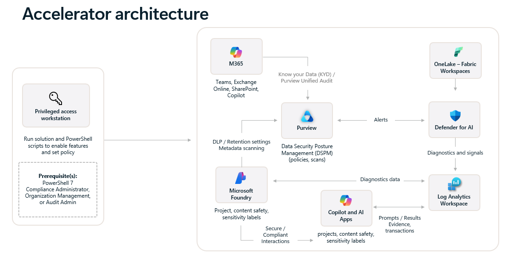

# Architecture Overview

This document provides a technical architecture view of the Data Agent Governance and Security Accelerator, including the solution architecture diagram and a class diagram showing the core components and their relationships.

---

## Solution Architecture

The accelerator orchestrates Microsoft Purview DSPM for AI, Defender for AI, and M365 compliance controls across Azure AI Foundry, Fabric, and custom agentic solutions.

---

## Component Class Diagram

The following class diagram illustrates the core entities, their relationships, and how the spec-driven automation orchestrates governance across Azure and Microsoft 365.

```mermaid
classDiagram
    class DspmSpec {
        +string tenantId
        +string subscriptionId
        +string resourceGroup
        +string location
        +PurviewConfig purview
        +AiFoundryConfig aiFoundry
        +FoundryConfig foundry
        +FabricConfig fabric
        +DlpPolicy dlpPolicy
        +Label[] labels
        +RetentionPolicy[] retentionPolicies
        +ActivityExport activityExport
        +AzurePolicy[] azurePolicies
        +DefenderForAI defenderForAI
    }

    class PurviewConfig {
        +string accountName
        +string resourceGroup
        +string subscriptionId
        +DataSource[] dataSources
        +Scan[] scans
    }

    class AiFoundryConfig {
        +string name
        +string resourceId
        +string subscriptionId
        +string resourceGroupName
    }

    class FoundryConfig {
        +FoundryResource[] resources
        +ContentSafetyConfig contentSafety
    }

    class FoundryResource {
        +string name
        +string resourceId
        +bool diagnostics
        +map tags
    }

    class ContentSafetyConfig {
        +string endpoint
        +KeyVaultReference apiKeySecretRef
        +TextBlocklist[] textBlocklists
        +int harmSeverityThreshold
    }

    class FabricConfig {
        +OneLakeRoot[] oneLakeRoots
        +FabricWorkspace[] workspaces
    }

    class OneLakeRoot {
        +string name
        +string resourceId
        +string scanName
    }

    class FabricWorkspace {
        +string name
        +string resourceId
        +string scanName
    }

    class DlpPolicy {
        +string name
        +string mode
        +LocationScope locations
        +DlpRule[] rules
    }

    class DlpRule {
        +string name
        +SensitiveInfoType[] sensitiveInfoTypes
        +bool blockAccess
        +bool notifyUser
    }

    class Label {
        +string name
        +string publishPolicyName
        +bool encryptionEnabled
        +LocationScope publishScopes
    }

    class RetentionPolicy {
        +string name
        +RetentionRule[] rules
        +LocationScope locations
    }

    class RetentionRule {
        +string name
        +int durationDays
        +string action
    }

    class ActivityExport {
        +string outputPath
        +string[] contentTypes
    }

    class AzurePolicy {
        +string name
        +string displayName
        +string scope
        +bool enabled
        +map parameters
    }

    class DefenderForAI {
        +string[] enableDefenderForCloudPlans
        +string logAnalyticsWorkspaceId
        +string[] diagnosticCategories
    }

    class DataSource {
        +string name
        +string kind
        +string resourceId
        +string collectionName
    }

    class Scan {
        +string name
        +string dataSourceName
        +string scanRulesetName
        +string schedule
    }

    class RunOrchestrator {
        +DspmSpec spec
        +string[] tags
        +bool dryRun
        +bool continueOnError
        +ExecutePlan()
        +ValidatePrerequisites()
    }

    class ScriptModule {
        <<abstract>>
        +string name
        +int order
        +string[] tags
        +Execute(spec)
        +Validate()
    }

    class FoundationModule {
        +EnsureResourceGroup()
        +EnsurePurviewAccount()
    }

    class M365Module {
        +ConnectCompliance()
        +EnableUnifiedAudit()
        +CreateDlpPolicy()
        +CreateLabels()
        +CreateRetentionPolicies()
    }

    class DspmModule {
        +RegisterDataSources()
        +RunScans()
        +SubscribeManagementActivity()
        +ExportAudit()
        +AssignAzurePolicies()
    }

    class DefenderModule {
        +EnableDefenderPlans()
        +EnableDiagnostics()
    }

    class FoundryModule {
        +RegisterFoundryResources()
        +ConfigureContentSafety()
        +TagResources()
    }

    class AzureResourceManager {
        +CreateResourceGroup()
        +ApplyTags()
        +AssignPolicy()
    }

    class PurviewClient {
        +RegisterDataSource()
        +TriggerScan()
        +GetScanResults()
    }

    class DefenderClient {
        +EnablePlan()
        +ConfigureDiagnostics()
        +GetSecurityPosture()
    }

    class ExchangeOnlineClient {
        +EnableUnifiedAudit()
        +CreateDlpPolicy()
        +PublishLabels()
        +CreateRetentionPolicy()
    }

    class ContentSafetyClient {
        +CreateBlocklist()
        +AddBlocklistItems()
        +ApplyToFoundryProject()
    }

    DspmSpec "1" --> "1" PurviewConfig
    DspmSpec "1" --> "1" AiFoundryConfig
    DspmSpec "1" --> "1" FoundryConfig
    DspmSpec "1" --> "0..1" FabricConfig
    DspmSpec "1" --> "0..1" DlpPolicy
    DspmSpec "1" --> "0..*" Label
    DspmSpec "1" --> "0..*" RetentionPolicy
    DspmSpec "1" --> "0..1" ActivityExport
    DspmSpec "1" --> "0..*" AzurePolicy
    DspmSpec "1" --> "1" DefenderForAI

    PurviewConfig "1" --> "0..*" DataSource
    PurviewConfig "1" --> "0..*" Scan

    FoundryConfig "1" --> "1..*" FoundryResource
    FoundryConfig "1" --> "0..1" ContentSafetyConfig

    FabricConfig "1" --> "0..*" OneLakeRoot
    FabricConfig "1" --> "0..*" FabricWorkspace

    DlpPolicy "1" --> "1..*" DlpRule

    RetentionPolicy "1" --> "1..*" RetentionRule

    RunOrchestrator "1" --> "1" DspmSpec
    RunOrchestrator "1" --> "1..*" ScriptModule

    ScriptModule <|-- FoundationModule
    ScriptModule <|-- M365Module
    ScriptModule <|-- DspmModule
    ScriptModule <|-- DefenderModule
    ScriptModule <|-- FoundryModule

    FoundationModule ..> AzureResourceManager : uses
    FoundationModule ..> PurviewClient : uses

    M365Module ..> ExchangeOnlineClient : uses

    DspmModule ..> PurviewClient : uses
    DspmModule ..> AzureResourceManager : uses

    DefenderModule ..> DefenderClient : uses

    FoundryModule ..> PurviewClient : uses
    FoundryModule ..> ContentSafetyClient : uses
    FoundryModule ..> AzureResourceManager : uses
```

---

## Component Descriptions

### Core Entities

| Component | Responsibility | Key Operations |
|-----------|----------------|----------------|
| **DspmSpec** | Central configuration contract defining all governance requirements | Loaded from `spec.local.json`; drives entire automation |
| **RunOrchestrator** | Executes the deployment plan based on tags | Validates prerequisites, sequences script modules by order |
| **ScriptModule** | Base abstraction for atomic governance steps | Each concrete module implements tag-specific logic |

### Configuration Blocks

| Block | Purpose | Example Scripts |
|-------|---------|-----------------|
| **PurviewConfig** | Purview account, data sources, scan schedules | `02-Ensure-PurviewAccount.ps1`, `03-Register-DataSource.ps1`, `04-Run-Scan.ps1` |
| **AiFoundryConfig** | Azure AI Foundry workspace metadata | Used by `30-Foundry-RegisterResources.ps1` |
| **FoundryConfig** | Foundry projects, Content Safety blocklists | `31-Foundry-ConfigureContentSafety.ps1` |
| **FabricConfig** | OneLake and Fabric workspace registration | `26-Register-OneLake.ps1`, `27-Register-FabricWorkspace.ps1` (commented out) |
| **DlpPolicy** | Data Loss Prevention rules for M365 | `12-Create-DlpPolicy.ps1` |
| **Label[]** | Sensitivity labels | `13-Create-SensitivityLabel.ps1` |
| **RetentionPolicy[]** | Retention rules for AI interaction data | `14-Create-RetentionPolicy.ps1` |
| **ActivityExport** | Audit log export configuration | `20-Subscribe-ManagementActivity.ps1`, `21-Export-Audit.ps1` |
| **AzurePolicy[]** | Azure Policy assignments | `05-Assign-AzurePolicies.ps1` |
| **DefenderForAI** | Defender for Cloud plans and diagnostics | `06-Enable-DefenderPlans.ps1`, `07-Enable-Diagnostics.ps1` |

### Script Modules (Execution Units)

| Module | Tags | Scripts Included |
|--------|------|-------------------|
| **FoundationModule** | `foundation` | `01-Ensure-ResourceGroup.ps1`, `02-Ensure-PurviewAccount.ps1` |
| **M365Module** | `m365` | `10-Connect-Compliance.ps1`, `11-Enable-UnifiedAudit.ps1`, `12-Create-DlpPolicy.ps1`, `13-Create-SensitivityLabel.ps1`, `14-Create-RetentionPolicy.ps1` |
| **DspmModule** | `dspm`, `scans`, `audit`, `policies` | `03-Register-DataSource.ps1`, `04-Run-Scan.ps1`, `05-Assign-AzurePolicies.ps1`, `20-Subscribe-ManagementActivity.ps1`, `21-Export-Audit.ps1` |
| **DefenderModule** | `defender`, `diagnostics` | `06-Enable-DefenderPlans.ps1`, `07-Enable-Diagnostics.ps1` |
| **FoundryModule** | `foundry`, `tags`, `contentsafety` | `25-Tag-ResourcesFromSpec.ps1`, `30-Foundry-RegisterResources.ps1`, `31-Foundry-ConfigureContentSafety.ps1` |

### Client Abstractions

| Client | Service | Operations |
|--------|---------|------------|
| **AzureResourceManager** | Azure Resource Manager | Resource group creation, tagging, policy assignment |
| **PurviewClient** | Microsoft Purview REST/SDK | Data source registration, scan triggers, catalog queries |
| **DefenderClient** | Microsoft Defender for Cloud | Plan enablement, diagnostic settings, security posture queries |
| **ExchangeOnlineClient** | Exchange Online / Security & Compliance PowerShell | Unified Audit toggle, DLP policy CRUD, label/retention publishing |
| **ContentSafetyClient** | Azure AI Content Safety | Blocklist creation, item management, Foundry project association |

---

## Execution Flow

1. **User invokes `run.ps1`** with `-Tags` (e.g., `foundation,dspm,defender,foundry`) and `-SpecPath ./spec.local.json`
2. **RunOrchestrator** loads `DspmSpec` from JSON and validates prerequisites (Azure login, PowerShell modules)
3. **Tag expansion** determines which `ScriptModule` instances to execute (ordered by `order` field)
4. **Each module**:
   - Reads relevant spec blocks (e.g., `FoundryModule` → `foundry.resources[]`)
   - Calls appropriate client (e.g., `PurviewClient.RegisterDataSource()`)
   - Logs results; continues or halts based on `-ContinueOnError`
5. **Post-execution** evidence collection via `17-Export-ComplianceInventory.ps1`, `21-Export-Audit.ps1`

---

## Relationships Summary

- **DspmSpec** is the single source of truth; all modules consume it
- **RunOrchestrator** sequences modules based on tags and order
- **Modules** delegate to **Clients** for actual API/PowerShell operations
- **One-to-many** relationships:
  - DspmSpec → Labels, RetentionPolicies, AzurePolicies (array fields)
  - PurviewConfig → DataSources, Scans
  - FoundryConfig → FoundryResources
- **Optional blocks** (0..1 cardinality):
  - DlpPolicy, ActivityExport, FabricConfig (gracefully skipped if missing)

---

## Extension Points

- **Add new ScriptModule**: Create `scripts/<area>/<NN>-<Action>.ps1`, register in `run.ps1` plan with unique order/tags
- **Extend DspmSpec**: Update `spec.dspm.template.json` schema, regenerate via `00-New-DspmSpec.ps1`, consume in relevant module
- **Swap Clients**: Replace `PurviewClient` implementation with custom REST wrapper or SDK version without touching module logic

---

## References

- [Solution Architecture Diagram](./doc-images/architectureDAGSA.png)
- [DSPM for Foundry Steps](./doc-images/DSPM-for-Foundry-Steps.png)
- [DSPM for All Services](./doc-images/DSPM-for-all-services-steps.png)
- [Deployment Guide](./DeploymentGuide.md)
- [Tag Reference (README)](../README.md#tag-reference)
- [Run Plan Breakdown (README)](../README.md#run-plan-breakdown)
